# NIS 2 compliance assessment — 27 EU Member States, 24 languages


A free self-assessment tool for compliance with the NIS 2 Directive and the
national law of the EU Member States. It asks about the entity profile,
determines its status (essential or important), names the competent
supervisory authority, the maximum fines and the statutory deadlines, walks
through a questionnaire and produces a management report.

Everything runs in the browser. There is no server, no account and no data
leaving the device — whatever you enter stays in browser storage and in the
files you save yourself. The tool also opens straight from disk, offline,
on a network cut off from the internet.

The tool was built so that network operators and data centres can prepare for
NIS 2 faster and see at once how much work lies ahead. Published by
[ITORO](https://itoro.com.pl) — we protect operator and data centre networks
against DDoS attacks.

**[Wersja polska → README.pl.md](README.pl.md)**

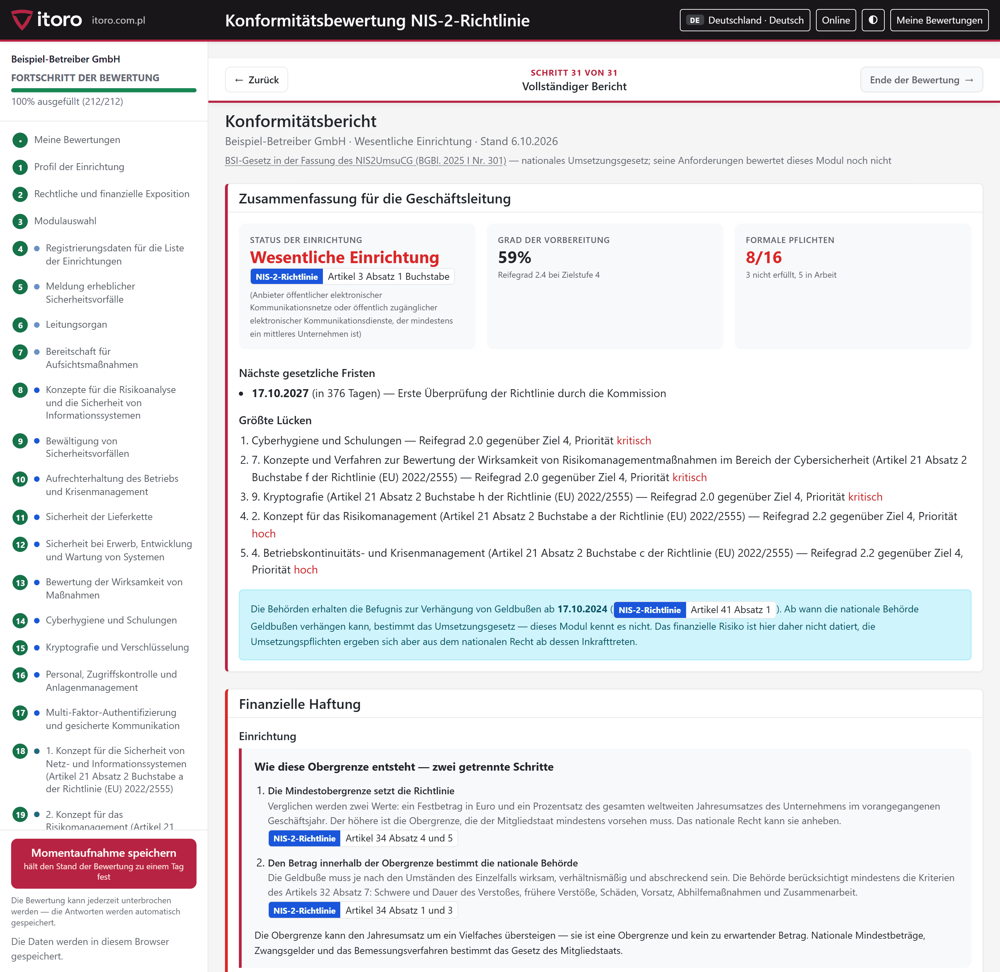

---

## Contents

- [What the assessment delivers](#what-the-assessment-delivers)
- [Running the tool](#running-the-tool)
- [How an assessment runs](#how-an-assessment-runs)
- [Sample reports](#sample-reports)
- [Legal scope — country by country](#legal-scope--country-by-country)
- [Two layers of law](#two-layers-of-law)
- [Language and country detection](#language-and-country-detection)
- [Repository layout](#repository-layout)
- [Privacy](#privacy)
- [Limitations](#limitations)
- [Extending the tool to another country](#extending-the-tool-to-another-country)
- [Frequently asked questions](#frequently-asked-questions)
- [Licence](#licence)
- [About ITORO](#about-itoro)

## What the assessment delivers

| | |
|---|---|
| **Entity status** | essential, important or out of scope — with the provision it follows from |
| **Supervisory authority** | the one competent for the sector and the country, with the reporting address |
| **Maximum fine** | both the fixed amount and the percentage, computed for the revenue entered |
| **Statutory deadlines** | counted down to today, with the legal basis |
| **Level of readiness** | maturity on a 0–5 scale against the target level |
| **List of gaps** | ordered by priority, each with its provision |
| **Export** | report for print and PDF, assessment data to XLSX and JSON |

The management report is ready after the profile alone, **before the first
question is answered** — entity status, supervisory authority and the maximum
fine follow from the law, not from the questionnaire.

## Running the tool

**[Download the latest release (ZIP)](https://github.com/itoro-pl/nis2-compliance-assessment/releases/latest)**
— unpack it and open `index.html`.

**No server is required.** Opening `index.html` in a browser starts the
whole thing: country selection, the step into the tool, all 24 languages,
the assessment, export to JSON and XLSX, and printing the report. The
libraries are bundled with the repository, so the page fetches nothing from
the network and works on a machine cut off from the internet.

One function needs a connection: pulling data from public registers in the
Polish module (tax number to name, address, legal form). Those fields can be
filled in by hand, and the „Offline" switch disables the queries for good.

An HTTP server is needed only to publish the tool on a website or on a local
network:

```bash
python -m http.server 8742
```

Then open `http://127.0.0.1:8742/`.

Useful addresses:

```text
ocena/index.html?panstwo=IE&jezyk=en            Ireland in English
ocena/index.html?panstwo=DE&jezyk=de            Germany in German
ocena/index.html?panstwo=IT&jezyk=en            Italy in English
ocena/index.html?panstwo=PL&jezyk=en&przyklad=1 sample report on fictional data
```

## How an assessment runs

**1. Entity profile.** Sector, roles, size, revenue. In the Polish module
a financial statement from the court register fills in most of the fields
and the tax number pulls the name, address and legal form — the file is read
by the browser, nothing leaves the device. Where a national module does not
exist yet, the same fields are filled in by hand.

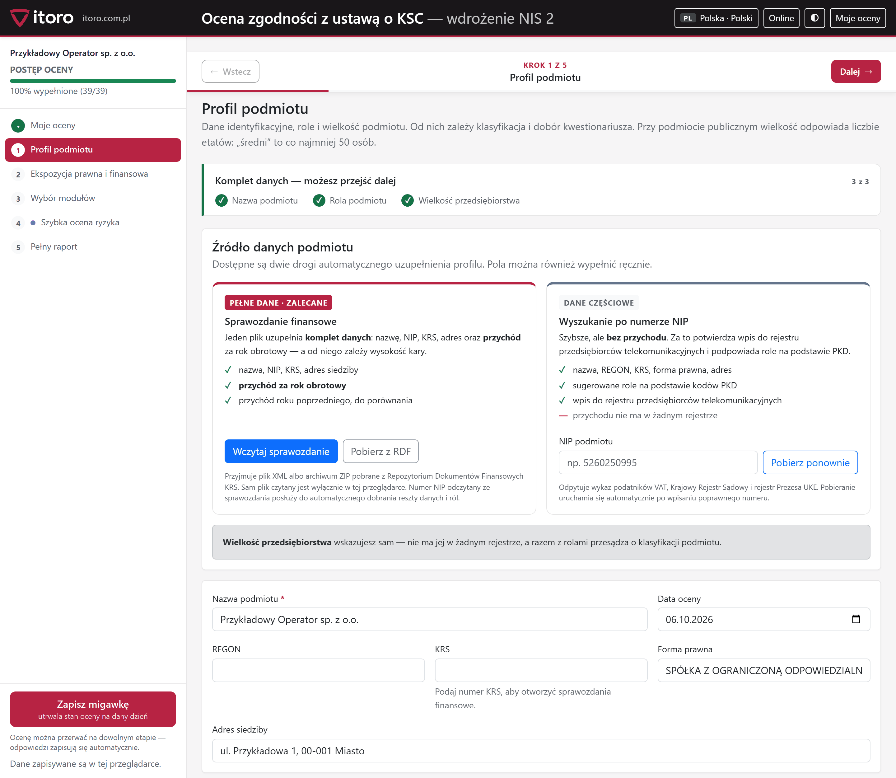

**2. Legal and financial exposure.** Status, authorities, fines, deadlines —
everything that follows from the profile alone, without a single question.

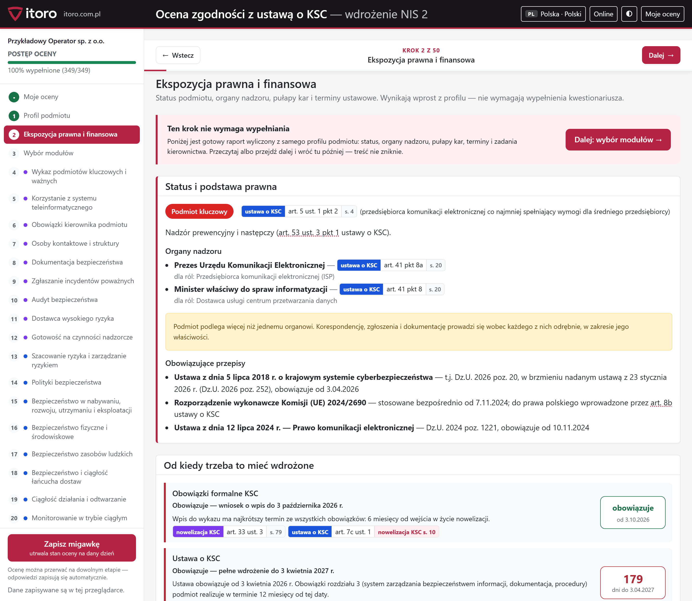

**3. Choice of modules.** An assessment does not have to cover everything at
once. You can see how many questions each module carries and what is left out
of this run.

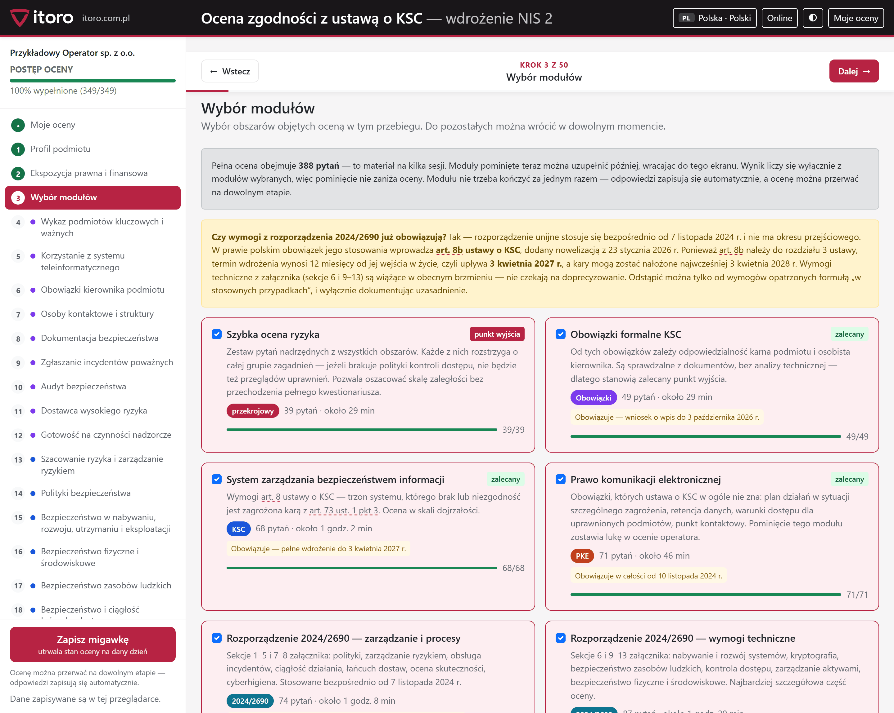

**4. Questionnaire.** Every question names the provision it follows from, and
the reference badge opens the act on the right page — in the PDF or in the
official service (EUR-Lex for EU law). Each answer can carry evidence, an
owner and a deadline.

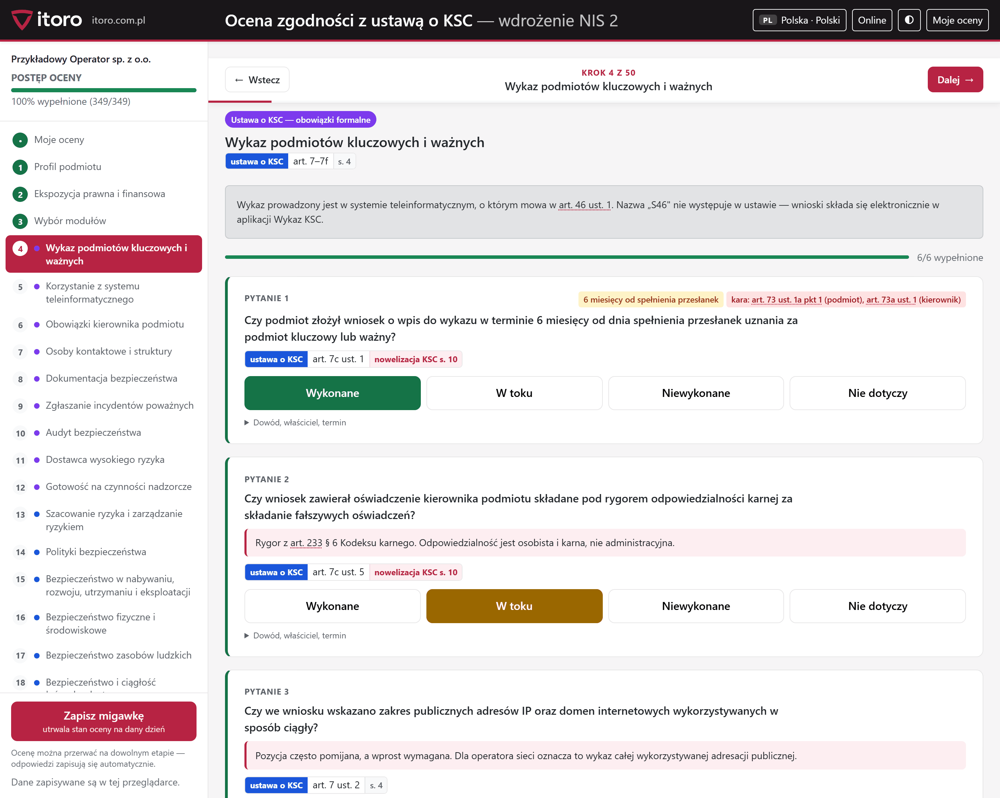

**5. Report.** Management summary, financial liability, maturity profile and
the list of gaps by priority.

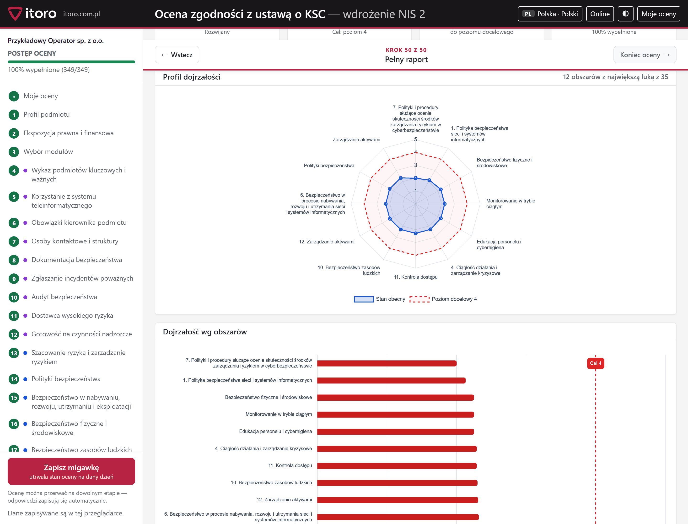

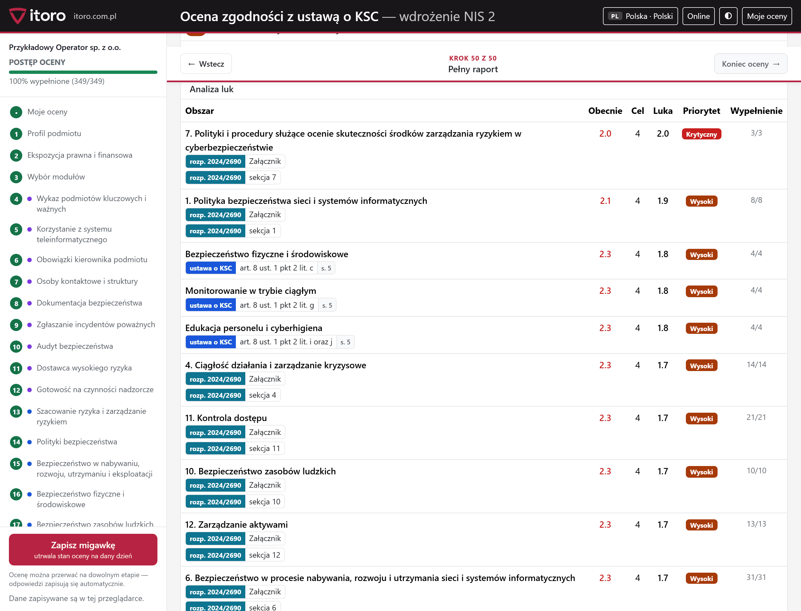

Dark mode works on every screen; contrast is checked by a WCAG 2.1 AA gate
(axe-core) in both themes.

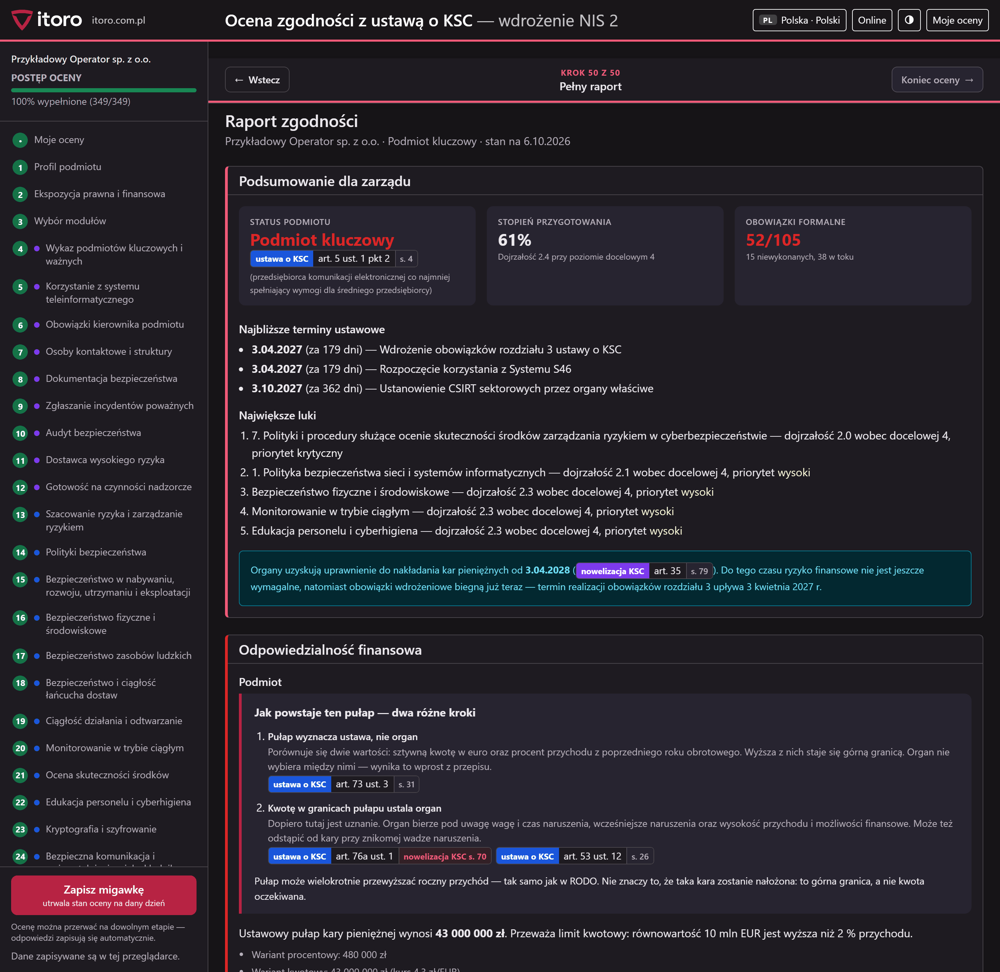

## Sample reports

The `przyklady/` directory holds **28 ready-made PDF reports — one for
each of the 27 Member States, in its official language**. They come from
the preview mode (`?przyklad=1`) on entirely fictional data: the company name,
revenue, management pay and all the answers are made up.

That way you can see exactly what comes out at the end without filling in
a questionnaire:

- **[Poland — full national-law module (PDF)](przyklady/raport-PL-pl.pdf)**
  — a report written in terms of the Polish act on the national cybersecurity
  system, with references to specific articles and pages;
  [the same assessment in English](przyklady/raport-PL-en.pdf).
- **[Germany](przyklady/raport-DE-de.pdf)**, **[Italy](przyklady/raport-IT-it.pdf)**,
  **[Romania](przyklady/raport-RO-ro.pdf)** and the rest — the common EU layer,
  with the transposing act of that country named.

The full list with links is in the table below.

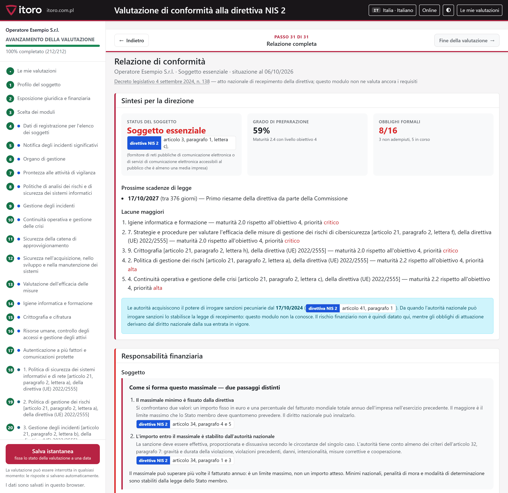

## Legal scope — country by country

The **Acts** column links to the directory holding the files in this
repository (the number says how many; besides the acts themselves it holds
implementing regulations and annexes). **Assessed under** says whether
the tool knows that country's national law or runs the assessment on the
common EU layer. **Sample report** opens the ready-made PDF.

| Country | Act transposing NIS 2 | Acts | Assessed under | Sample report |
|---|---|---|---|---|
| 🇦🇹 Austria | [NIS-Gesetz 2026 (NISG 2026), BGBl. I Nr. 94/2025](https://ris.bka.gv.at/Dokumente/BgblAuth/BGBLA_2025_I_94/BGBLA_2025_I_94.pdf) | [1](ustawy/AT/) | EU law | [DE](przyklady/raport-AT-de.pdf) |
| 🇧🇪 Belgium | [Loi du 26 avril 2024 établissant un cadre pour la cybersécurité / Wet van 26 april 2024](https://www.ejustice.just.fgov.be/eli/loi/2024/04/26/2024202344/justel) | [9](ustawy/BE/) | EU law | [NL](przyklady/raport-BE-nl.pdf) |
| 🇧🇬 Bulgaria | [Закон за изменение и допълнение на Закона за киберсигурност, ДВ бр. 17/2026](https://dv.parliament.bg/DVWeb/broeveList.faces) | [2](ustawy/BG/) | EU law | [BG](przyklady/raport-BG-bg.pdf) |
| 🇭🇷 Croatia | [Zakon o kibernetičkoj sigurnosti, NN 14/2024](https://narodne-novine.nn.hr/clanci/sluzbeni/2024_02_14_254.html) | [3](ustawy/HR/) | EU law | [HR](przyklady/raport-HR-hr.pdf) |
| 🇨🇾 Cyprus | [Ο περί Ασφάλειας Δικτύων και Συστημάτων Πληροφοριών Νόμος, Ν. 60(Ι)/2025](https://www.cylaw.org/nomoi/arith/2025_1_060.pdf) | [3](ustawy/CY/) | EU law | [EL](przyklady/raport-CY-el.pdf) |
| 🇨🇿 Czechia | [Zákon č. 264/2025 Sb., o kybernetické bezpečnosti](https://e-sbirka.gov.cz/sb/2025/264) | [3](ustawy/CZ/) | EU law | [CS](przyklady/raport-CZ-cs.pdf) |
| 🇩🇰 Denmark | [Lov nr. 434 af 6. maj 2025 om foranstaltninger til sikring af et højt cybersikkerhedsniveau](https://www.retsinformation.dk/eli/lta/2025/434) | [1](ustawy/DK/) | EU law | [DA](przyklady/raport-DK-da.pdf) |
| 🇪🇪 Estonia | [Küberturvalisuse seadus (KüTS)](https://www.riigiteataja.ee/akt/130122025004) | [1](ustawy/EE/) | EU law | [ET](przyklady/raport-EE-et.pdf) |
| 🇫🇮 Finland | [Kyberturvallisuuslaki 124/2025](https://www.finlex.fi/fi/lainsaadanto/2025/124) | [2](ustawy/FI/) | EU law | [FI](przyklady/raport-FI-fi.pdf) |
| 🇫🇷 France | — no transposing act yet | — | EU law | [FR](przyklady/raport-FR-fr.pdf) |
| 🇩🇪 Germany | [BSI-Gesetz in der Fassung des NIS2UmsuCG (BGBl. 2025 I Nr. 301)](https://www.gesetze-im-internet.de/bsig_2025/BSIG.pdf) | [2](ustawy/DE/) | EU law | [DE](przyklady/raport-DE-de.pdf) |
| 🇬🇷 Greece | [Νόμος 5160/2024 (ΦΕΚ Α΄ 195) και νόμος 5305/2026 (ΦΕΚ Α΄ 85)](https://cyber.gov.gr/) | [2](ustawy/GR/) | EU law | [EL](przyklady/raport-GR-el.pdf) |
| 🇭🇺 Hungary | [2024. évi LXIX. törvény Magyarország kiberbiztonságáról](https://njt.jog.gov.hu/jogszabaly/2024-69-00-00) | [3](ustawy/HU/) | EU law | [HU](przyklady/raport-HU-hu.pdf) |
| 🇮🇪 Ireland | — no transposing act yet | — | EU law | [EN](przyklady/raport-IE-en.pdf) |
| 🇮🇹 Italy | [Decreto legislativo 4 settembre 2024, n. 138](https://www.normattiva.it/uri-res/N2Ls?urn:nir:stato:decreto.legislativo:2024-09-04;138) | [10](ustawy/IT/) | EU law | [IT](przyklady/raport-IT-it.pdf) |
| 🇱🇻 Latvia | [Nacionālās kiberdrošības likums](https://likumi.lv/ta/id/353390) | [2](ustawy/LV/) | EU law | [LV](przyklady/raport-LV-lv.pdf) |
| 🇱🇹 Lithuania | [Lietuvos Respublikos kibernetinio saugumo įstatymas (nauja redakcija, Nr. XIV-2902)](https://e-seimas.lrs.lt/portal/legalAct/lt/TAD/1a8657f2427a11efb121d2fe3a0eff27) | [4](ustawy/LT/) | EU law | [LT](przyklady/raport-LT-lt.pdf) |
| 🇱🇺 Luxembourg | [Loi du 5 mai 2026, Mémorial A 225](https://data.legilux.public.lu/eli/etat/leg/loi/2026/05/05/a225/jo) | [1](ustawy/LU/) | EU law | [FR](przyklady/raport-LU-fr.pdf) |
| 🇲🇹 Malta | [Subsidiary Legislation 460.41 — Measures for a High Common Level of Cybersecurity](https://legislation.mt/eli/sl/460.41/eng) | [2](ustawy/MT/) | EU law | [MT](przyklady/raport-MT-mt.pdf) |
| 🇳🇱 Netherlands | [Cyberbeveiligingswet, Stb. 2026, 187](https://zoek.officielebekendmakingen.nl/stb-2026-187.html) | [1](ustawy/NL/) | EU law | [NL](przyklady/raport-NL-nl.pdf) |
| 🇵🇱 Poland | Act on the national cybersecurity system (as amended in 2026) | [4](ocena/ustawy/) | national law | [EN](przyklady/raport-PL-en.pdf) · [PL](przyklady/raport-PL-pl.pdf) |
| 🇵🇹 Portugal | [Decreto-Lei n.º 125/2025 — Regime Jurídico da Segurança do Ciberespaço](https://diariodarepublica.pt/dr/detalhe/decreto-lei/125-2025) | [2](ustawy/PT/) | EU law | [PT](przyklady/raport-PT-pt.pdf) |
| 🇷🇴 Romania | [OUG nr. 155/2024, aprobată cu modificări prin Legea nr. 124/2025](https://legislatie.just.ro/Public/DetaliiDocument/293121) | [9](ustawy/RO/) | EU law | [RO](przyklady/raport-RO-ro.pdf) |
| 🇸🇰 Slovakia | [Zákon č. 69/2018 Z. z. v znení zákona č. 366/2024 Z. z.](https://www.slov-lex.sk/ezbierky/pravne-predpisy/SK/ZZ/2018/69/) | [3](ustawy/SK/) | EU law | [SK](przyklady/raport-SK-sk.pdf) |
| 🇸🇮 Slovenia | [Zakon o informacijski varnosti (ZInfV-1), Uradni list RS 40/25](https://pisrs.si/pregledPredpisa?id=ZAKO8934) | [1](ustawy/SI/) | EU law | [SL](przyklady/raport-SI-sl.pdf) |
| 🇪🇸 Spain | — no transposing act yet | — | EU law | [ES](przyklady/raport-ES-es.pdf) |
| 🇸🇪 Sweden | [Cybersäkerhetslag (2025:1506)](https://data.riksdagen.se/dokument/sfs-2025-1506.html) | [6](ustawy/SE/) | EU law | [SV](przyklady/raport-SE-sv.pdf) |

That is **77 files of acts and implementing measures from 24 countries**. The file
`ustawy/manifest.tsv` gives the source address and the method of retrieval for
each of them. Some countries publish their law only as a web application —
there the PDF is a printout of the official HTML, which the manifest records,
and the links lead to the official source.

## Two layers of law

| Layer | For whom | Basis |
|---|---|---|
| **National law + common layer** | Poland | the act on the national cybersecurity system as amended in 2026, the Electronic Communications Law, Annex 4 — together with Implementing Regulation (EU) 2024/2690 |
| **Common EU layer** | the other 26 countries | Implementing Regulation (EU) 2024/2690 (directly applicable) and the obligations following directly from Directive (EU) 2022/2555 |

Regulation 2024/2690 applies directly in every Member State, so a national-law
module does not replace the common layer but adds to it: a Polish entity answers
the questions of both. For countries without a national-law module the assessment
runs on the common layer alone, and the tool says so plainly — instead of pretending to know national
provisions that have not been written down yet. The transposing act of that
country is named all the same, on the first screen and above the report,
because the entity is bound by it whether or not the module exists.

## Language and country detection

The page recognises the browser language and proposes the matching country:
`de-AT` → Austria in German, `sv-FI` → Finland in Swedish, `pt-BR` → Portugal
in Portuguese. A browser set to English without an EU region gets no guessed
country — it sees the list of 27 Member States and chooses. A language
from outside the Union opens the English version.

The choice is remembered in the browser, so the next visit lands where the
last one did. It can also be given in the address: `?panstwo=DE&jezyk=de`.

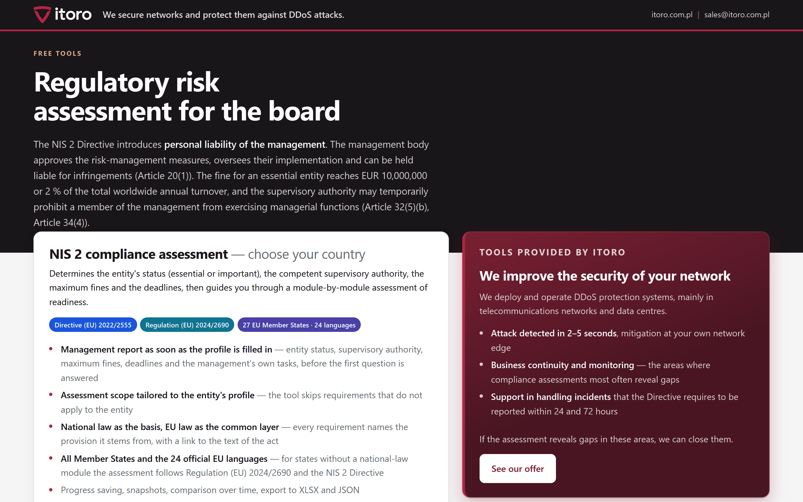

The country list shows what each entity is assessed under: national law, or —
until a national module exists — the common EU layer.

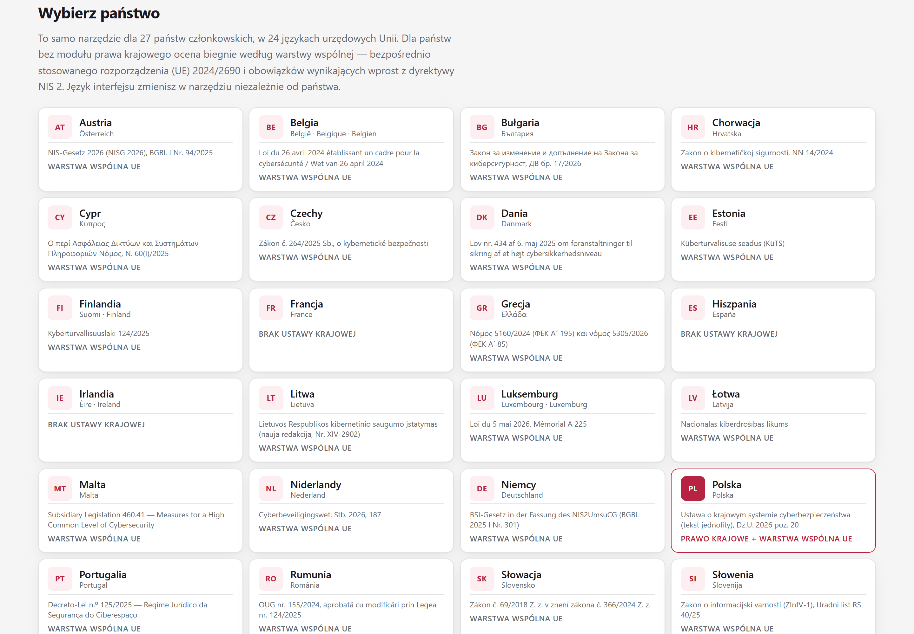

## Repository layout

```text
index.html          entry page — language and country autodetection
landing/            entry page script and dictionaries (24 languages)
ocena/              the tool
  core/             classification, scoring, assessment state, module loader
  ui/               wizard, dashboard, selection page
  locale/           interface texts in 24 languages
  kraje/pl/         Polish law module: requirement catalogue, thresholds, fines, registers
  kraje/ue/         common EU layer + the list of transposing acts
  wspolne/reg2690/  structure of Implementing Regulation (EU) 2024/2690
  ustawy/           Polish acts the PL module links to
  vendor/           Bootstrap, Chart.js, SheetJS — bundled so it works offline
ustawy/             texts of the acts of 23 countries + manifest.tsv with each file's source
przyklady/          28 sample reports in PDF
zrzuty/             images for this file
```

## Privacy

The tool has no server and does not send assessments anywhere. Specifically:

- answers and the profile live in the browser's `localStorage`; export and
  import go through files the user picks;
- the financial statement is read by the browser — the file never leaves the
  device;
- the only outbound requests are queries to public registers in the Polish
  module (tax number to name, address, legal form); **the „Offline" switch in
  the top bar turns all of them off** and everything else keeps working;
- the libraries are bundled in the repository, so the page fetches nothing
  from a CDN.

## Limitations

- it does not send data and has no server — so an assessment cannot be
  recovered from another device;
- it does not replace legal advice or an audit;
- it does not prejudge the supervisory authority's decision: it shows the
  statutory ceilings and deadlines, it does not predict rulings;
- outside Poland it does not assess requirements arising from national acts —
  the questions come from the common EU layer; the national act itself is
  named, included and cited in the report.

## Extending the tool to another country

The act transposing NIS 2 is named, linked and included for every country
that has transposed the Directive — texts from 24 countries.
What is missing is something else: **a question catalogue mapped to the
provisions of those acts**. Such a catalogue exists so far for Poland; in the
other 26 countries the questions come from the common EU layer and the
references point to Regulation (EU) 2024/2690 and the Directive rather than to
articles of the national act.

Filling that layer in needs no permission from us and no access to anything
beyond this repository — **a pull request is enough**. Two kinds of
contribution are useful:

**A national-law module.** The model is `ocena/kraje/pl/` — acts and the
article-to-page map (`akty.js`), thresholds and fines (`meta.js`), the
requirement catalogue (`katalog.js`), formal obligations (`obowiazki.js`).
The module texts are written in the language of your country; the interface
stays translated. The register of countries and languages is in
`ocena/core/panstwa.js`.

**Reading financial statements and register data.** In the Polish version
a statement from the court register fills in most of the profile and the tax
number pulls the name, address and legal form. Equivalents exist in many
countries — free and without an API key in, among others, Romania, France,
Slovakia, Estonia, Latvia, Lithuania, Denmark, Belgium and Sweden. Reference
implementation: `ocena/kraje/pl/rejestry-esf.js` (reading the statement in the
browser) and `ocena/kraje/pl/rejestry-nip.js` (querying the registers). One
condition, always the same: **the file is read in the browser only and the
data do not leave the device**.

Translation fixes are equally welcome. Interface texts are in
`ocena/locale/<language>.js` and the common module in
`ocena/kraje/ue/napisy/<language>.js`; every file carries the same set of keys,
so a fix amounts to changing one value.

## Frequently asked questions

**Is this an audit?**
No. It is a self-assessment: the entity gives the answers, the tool orders
them by the provisions and shows the gaps. The report is neither legal advice
nor an audit within the meaning of cybersecurity law.

**Does any data reach ITORO?**
No. There is no server it could reach. The repository can be opened from disk
with the network cut off — the tool works the same.

**How do I know the maximum fine is computed correctly?**
Next to every amount you see both variants — fixed and percentage — and the
provision they follow from. The tool shows the statutory ceiling, not an
expected fine; the amount within the ceiling is set by the authority.

**Why does the assessment for my country run on EU law rather than national law?**
A question catalogue mapped to national provisions exists so far only for
Poland. The transposing act of the selected country is named, included in the
repository and cited in the report, while the questions and references come
from Regulation 2024/2690 and the obligations following directly from the
Directive. A national catalogue can be contributed by pull request.

**May the tool be used in client work?**
Yes, commercially as well. A law firm or a security team then works with the
tool and its questions under no further conditions; the licence terms apply
only to publishing a modified version of your own.

**Can I replace the logo and the name?**
The code and the content — yes, on the terms of the licences. The ITORO
trademark is not covered by them: a modified copy should not suggest that it
comes from us.

## Licence

Code: **AGPL-3.0-or-later** (file `LICENSE`).
Substantive content — questions, requirement descriptions, documentation:
**CC BY-SA 4.0** (file `LICENSE-TRESC.md`).

The tool may be used, modified and redistributed, commercially as well,
provided the same licence is kept and authorship is credited. Anyone running
a modified version as a network service makes its source available to the
users of that service.

The texts of legal acts in `ustawy/` and `ocena/ustawy/` and the libraries in
`ocena/vendor/` have their own legal status — see `NOTICE`.

---

## About ITORO

[ITORO](https://itoro.com.pl) protects telecom operator, ISP and data centre
networks against DDoS attacks: we deploy and maintain detection and mitigation
at the network edge (WanGuard, RTBH, BGP FlowSpec). We built this tool to help
our sector prepare for NIS 2 and make it available free of charge.

---

**Version 1.2.0 of 2026-10-06.** Changelog: `ocena/zmiany.html`.
Please report defects and propose changes through issues and pull requests in
this repository.
