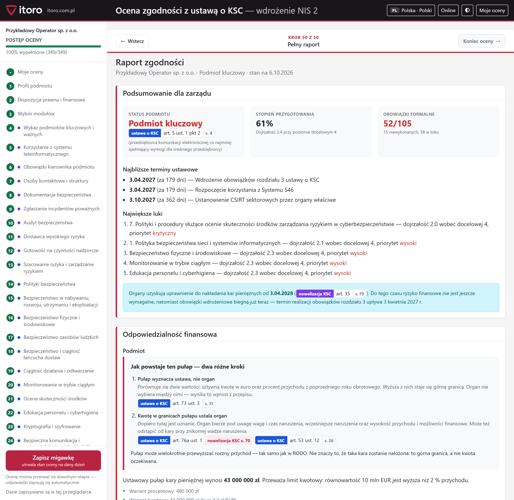
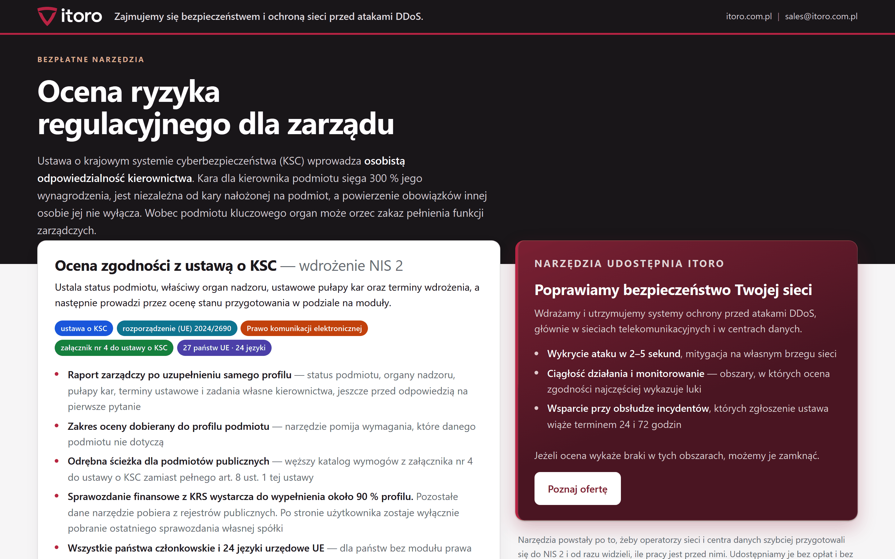
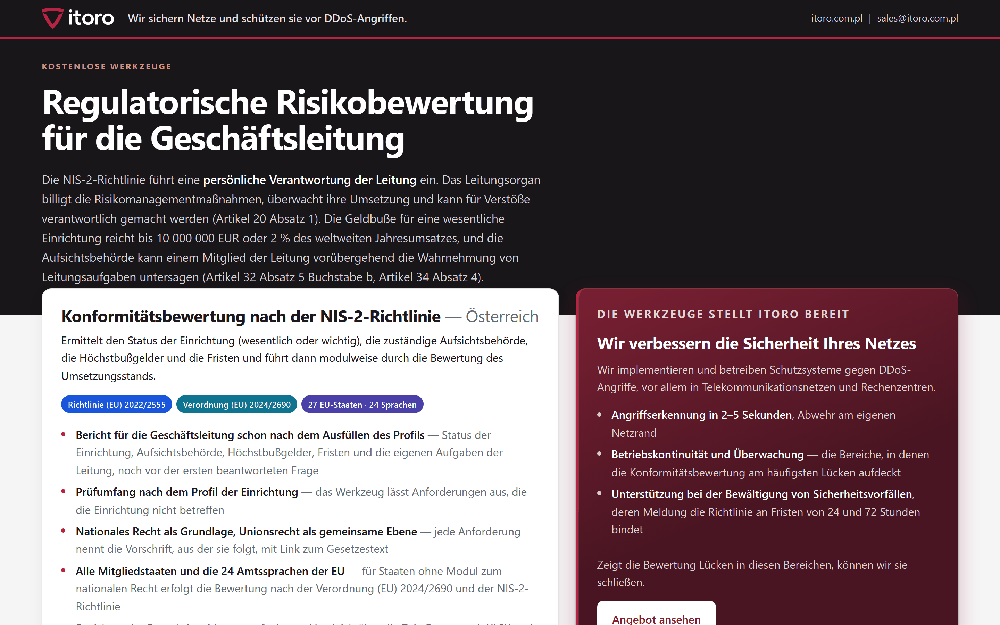

# Ocena zgodności z NIS 2 — 27 państw Unii, 24 języki


Bezpłatne narzędzie do samooceny zgodności z dyrektywą NIS 2 i prawem
krajowym państw członkowskich. Pyta o profil podmiotu, ustala status
(kluczowy albo ważny), wskazuje organ nadzoru, pułapy kar i terminy
ustawowe, prowadzi przez kwestionariusz i wystawia raport zarządczy.

Działa w całości w przeglądarce. Nie ma serwera, konta ani wysyłania
danych — wszystko, co wpiszesz, zostaje w pamięci przeglądarki i w plikach,
które sam zapiszesz na dysku. Narzędzie otwiera się także z pliku na dysku,
bez internetu, w sieci odciętej od świata.

Narzędzie powstało po to, żeby operatorzy sieci i centra danych szybciej
przygotowali się do NIS 2 i od razu widzieli, ile pracy jest przed nimi.
Udostępnia je [ITORO](https://itoro.com.pl) — zajmujemy się ochroną sieci
przed atakami DDoS u operatorów telekomunikacyjnych i w centrach danych.

**[English version → README.md](README.md)**



---

## Spis treści

- [Co daje ocena](#co-daje-ocena)
- [Uruchomienie](#uruchomienie)
- [Przebieg oceny](#przebieg-oceny)
- [Raporty poglądowe](#raporty-pogl%C4%85dowe)
- [Zakres prawa — państwo po państwie](#zakres-prawa--pa%C5%84stwo-po-pa%C5%84stwie)
- [Dwie warstwy prawa](#dwie-warstwy-prawa)
- [Dobór języka i państwa](#dob%C3%B3r-j%C4%99zyka-i-pa%C5%84stwa)
- [Układ repozytorium](#uk%C5%82ad-repozytorium)
- [Prywatność](#prywatno%C5%9B%C4%87)
- [Ograniczenia](#ograniczenia)
- [Rozszerzenie na kolejne państwo](#rozszerzenie-na-kolejne-pa%C5%84stwo)
- [Najczęstsze pytania](#najcz%C4%99stsze-pytania)
- [Licencja](#licencja)
- [O ITORO](#o-itoro)

## Co daje ocena

| | |
|---|---|
| **Status podmiotu** | kluczowy, ważny albo poza zakresem — z przepisem, z którego to wynika |
| **Organ nadzoru** | właściwy dla sektora i państwa, z adresem zgłoszeń |
| **Pułap kary** | kwotowy i procentowy, policzony dla podanego przychodu |
| **Terminy ustawowe** | odliczane do dnia dzisiejszego, z podstawą prawną |
| **Stopień przygotowania** | dojrzałość w skali 0–5 wobec poziomu docelowego |
| **Lista luk** | uporządkowana według priorytetu, z przepisem przy każdej |
| **Eksport** | raport do druku i PDF, dane oceny do XLSX i JSON |

Raport zarządczy powstaje już po samym profilu, **przed odpowiedzią na
pierwsze pytanie** — bo status podmiotu, organ nadzoru i pułap kary wynikają
z przepisów, nie z kwestionariusza.

## Uruchomienie

**Serwer nie jest potrzebny.** Otwarcie pliku `index.html` w przeglądarce
uruchamia całość: wybór państwa, przejście do narzędzia, 24 języki,
ocenę, eksport do JSON i XLSX oraz wydruk raportu. Biblioteki są dołączone
do repozytorium, więc strona nie pobiera niczego z sieci i działa na
komputerze odciętym od internetu.

Połączenia wymaga jedna funkcja: dociąganie danych z publicznych rejestrów
w module polskim (numer podatkowy → nazwa, adres, forma prawna). Pola te
można wypełnić ręcznie, a przełącznik „Offline" wyłącza zapytania na stałe.

Serwer HTTP jest potrzebny dopiero przy udostępnieniu narzędzia na stronie
albo w sieci lokalnej:

```bash
python -m http.server 8742
```

Następnie `http://127.0.0.1:8742/`.

Przydatne adresy:

```text
ocena/index.html?panstwo=PL&jezyk=pl            Polska po polsku
ocena/index.html?panstwo=AT&jezyk=de            Austria po niemiecku
ocena/index.html?panstwo=IT&jezyk=en            Włochy po angielsku
ocena/index.html?panstwo=PL&jezyk=pl&przyklad=1 raport poglądowy na danych fikcyjnej spółki
```

## Przebieg oceny

**1. Profil podmiotu.** Sektor, role, wielkość, przychód. W wersji polskiej
sprawozdanie finansowe z rejestru sądowego wypełnia większość pól, a numer
podatkowy dociąga nazwę, adres i formę prawną — plik czyta przeglądarka,
nic nie wychodzi poza urządzenie. Tam, gdzie modułu krajowego jeszcze nie
ma, te same pola wypełnia się ręcznie.


**2. Ekspozycja prawna i finansowa.** Status, organy, kary, terminy —
wszystko, co wynika z samego profilu, bez jednego pytania.


**3. Wybór modułów.** Ocena nie musi obejmować wszystkiego naraz. Widać,
ile pytań niesie każdy moduł i co zostaje poza tym przebiegiem.


**4. Kwestionariusz.** Każde pytanie wskazuje przepis, z którego wynika,
a plakietka odesłania otwiera akt na właściwej stronie — w PDF-ie albo
w serwisie urzędowym (EUR-Lex dla prawa Unii). Przy odpowiedzi można
zapisać dowód, właściciela i termin.


**5. Raport.** Podsumowanie dla zarządu, odpowiedzialność finansowa,
profil dojrzałości i wykaz luk według priorytetu.


Motyw ciemny działa na każdym ekranie; kontrast sprawdza brama WCAG 2.1 AA
(axe-core) w obu motywach.


## Raporty poglądowe

Katalog `przyklady/` zawiera **28 gotowych raportów PDF — po jednym dla
każdego z 27 państw, w jego języku urzędowym**. Powstały z trybu
poglądowego (`?przyklad=1`) na danych w całości fikcyjnych: nazwa spółki,
przychód, wynagrodzenie zarządu i wszystkie odpowiedzi są wymyślone.

Dzięki temu widać, co dokładnie dostaje się na końcu, bez wypełniania
kwestionariusza:

- **[Polska — pełny moduł prawa krajowego (PDF)](przyklady/raport-PL-pl.pdf)**
  — raport opisany ustawą o krajowym systemie cyberbezpieczeństwa,
  z odesłaniami do konkretnych artykułów i stron aktów;
  [ta sama ocena po angielsku](przyklady/raport-PL-en.pdf).
- **[Niemcy](przyklady/raport-DE-de.pdf)**, **[Włochy](przyklady/raport-IT-it.pdf)**,
  **[Rumunia](przyklady/raport-RO-ro.pdf)** i pozostałe — warstwa wspólna Unii,
  z nazwanym aktem wdrażającym danego państwa.

Pełny wykaz z odsyłaczami jest w tabeli niżej.


## Zakres prawa — państwo po państwie

Kolumna **Ustawy** prowadzi do katalogu z plikami w tym repozytorium
(liczba = ile plików; obok samych ustaw leżą tam rozporządzenia wykonawcze
i załączniki). Kolumna **Ocena według** mówi, czy narzędzie zna
prawo krajowe danego państwa, czy prowadzi ocenę według warstwy wspólnej
Unii. Kolumna **Raport poglądowy** otwiera gotowy PDF.

| Państwo | Akt wdrażający NIS 2 | Ustawy | Ocena według | Raport poglądowy |
|---|---|---|---|---|
| 🇦🇹 Austria | [NIS-Gesetz 2026 (NISG 2026), BGBl. I Nr. 94/2025](https://ris.bka.gv.at/Dokumente/BgblAuth/BGBLA_2025_I_94/BGBLA_2025_I_94.pdf) | [1](ustawy/AT/) | prawa Unii | [DE](przyklady/raport-AT-de.pdf) |
| 🇧🇪 Belgia | [Loi du 26 avril 2024 établissant un cadre pour la cybersécurité / Wet van 26 april 2024](https://www.ejustice.just.fgov.be/eli/loi/2024/04/26/2024202344/justel) | [9](ustawy/BE/) | prawa Unii | [NL](przyklady/raport-BE-nl.pdf) |
| 🇧🇬 Bułgaria | [Закон за изменение и допълнение на Закона за киберсигурност, ДВ бр. 17/2026](https://dv.parliament.bg/DVWeb/broeveList.faces) | [2](ustawy/BG/) | prawa Unii | [BG](przyklady/raport-BG-bg.pdf) |
| 🇭🇷 Chorwacja | [Zakon o kibernetičkoj sigurnosti, NN 14/2024](https://narodne-novine.nn.hr/clanci/sluzbeni/2024_02_14_254.html) | [3](ustawy/HR/) | prawa Unii | [HR](przyklady/raport-HR-hr.pdf) |
| 🇨🇾 Cypr | [Ο περί Ασφάλειας Δικτύων και Συστημάτων Πληροφοριών Νόμος, Ν. 60(Ι)/2025](https://www.cylaw.org/nomoi/arith/2025_1_060.pdf) | [3](ustawy/CY/) | prawa Unii | [EL](przyklady/raport-CY-el.pdf) |
| 🇨🇿 Czechy | [Zákon č. 264/2025 Sb., o kybernetické bezpečnosti](https://e-sbirka.gov.cz/sb/2025/264) | [3](ustawy/CZ/) | prawa Unii | [CS](przyklady/raport-CZ-cs.pdf) |
| 🇩🇰 Dania | [Lov nr. 434 af 6. maj 2025 om foranstaltninger til sikring af et højt cybersikkerhedsniveau](https://www.retsinformation.dk/eli/lta/2025/434) | [1](ustawy/DK/) | prawa Unii | [DA](przyklady/raport-DK-da.pdf) |
| 🇪🇪 Estonia | [Küberturvalisuse seadus (KüTS)](https://www.riigiteataja.ee/akt/130122025004) | [1](ustawy/EE/) | prawa Unii | [ET](przyklady/raport-EE-et.pdf) |
| 🇫🇮 Finlandia | [Kyberturvallisuuslaki 124/2025](https://www.finlex.fi/fi/lainsaadanto/2025/124) | [2](ustawy/FI/) | prawa Unii | [FI](przyklady/raport-FI-fi.pdf) |
| 🇫🇷 Francja | — ustawy wdrażającej jeszcze nie ma | — | prawa Unii | [FR](przyklady/raport-FR-fr.pdf) |
| 🇬🇷 Grecja | [Νόμος 5160/2024 (ΦΕΚ Α΄ 195) και νόμος 5305/2026 (ΦΕΚ Α΄ 85)](https://cyber.gov.gr/) | [2](ustawy/GR/) | prawa Unii | [EL](przyklady/raport-GR-el.pdf) |
| 🇪🇸 Hiszpania | — ustawy wdrażającej jeszcze nie ma | — | prawa Unii | [ES](przyklady/raport-ES-es.pdf) |
| 🇮🇪 Irlandia | — ustawy wdrażającej jeszcze nie ma | — | prawa Unii | [EN](przyklady/raport-IE-en.pdf) |
| 🇱🇹 Litwa | [Lietuvos Respublikos kibernetinio saugumo įstatymas (nauja redakcija, Nr. XIV-2902)](https://e-seimas.lrs.lt/portal/legalAct/lt/TAD/1a8657f2427a11efb121d2fe3a0eff27) | [4](ustawy/LT/) | prawa Unii | [LT](przyklady/raport-LT-lt.pdf) |
| 🇱🇺 Luksemburg | [Loi du 5 mai 2026, Mémorial A 225](https://data.legilux.public.lu/eli/etat/leg/loi/2026/05/05/a225/jo) | [1](ustawy/LU/) | prawa Unii | [FR](przyklady/raport-LU-fr.pdf) |
| 🇲🇹 Malta | [Subsidiary Legislation 460.41 — Measures for a High Common Level of Cybersecurity](https://legislation.mt/eli/sl/460.41/eng) | [2](ustawy/MT/) | prawa Unii | [MT](przyklady/raport-MT-mt.pdf) |
| 🇳🇱 Niderlandy | [Cyberbeveiligingswet, Stb. 2026, 187](https://zoek.officielebekendmakingen.nl/stb-2026-187.html) | [1](ustawy/NL/) | prawa Unii | [NL](przyklady/raport-NL-nl.pdf) |
| 🇩🇪 Niemcy | [BSI-Gesetz in der Fassung des NIS2UmsuCG (BGBl. 2025 I Nr. 301)](https://www.gesetze-im-internet.de/bsig_2025/BSIG.pdf) | [2](ustawy/DE/) | prawa Unii | [DE](przyklady/raport-DE-de.pdf) |
| 🇵🇱 Polska | ustawa o krajowym systemie cyberbezpieczeństwa (z nowelizacją z 2026 r.) | [4](ocena/ustawy/) | prawa krajowego | [EN](przyklady/raport-PL-en.pdf) · [PL](przyklady/raport-PL-pl.pdf) |
| 🇵🇹 Portugalia | [Decreto-Lei n.º 125/2025 — Regime Jurídico da Segurança do Ciberespaço](https://diariodarepublica.pt/dr/detalhe/decreto-lei/125-2025) | [2](ustawy/PT/) | prawa Unii | [PT](przyklady/raport-PT-pt.pdf) |
| 🇷🇴 Rumunia | [OUG nr. 155/2024, aprobată cu modificări prin Legea nr. 124/2025](https://legislatie.just.ro/Public/DetaliiDocument/293121) | [9](ustawy/RO/) | prawa Unii | [RO](przyklady/raport-RO-ro.pdf) |
| 🇸🇪 Szwecja | [Cybersäkerhetslag (2025:1506)](https://data.riksdagen.se/dokument/sfs-2025-1506.html) | [6](ustawy/SE/) | prawa Unii | [SV](przyklady/raport-SE-sv.pdf) |
| 🇸🇰 Słowacja | [Zákon č. 69/2018 Z. z. v znení zákona č. 366/2024 Z. z.](https://www.slov-lex.sk/ezbierky/pravne-predpisy/SK/ZZ/2018/69/) | [3](ustawy/SK/) | prawa Unii | [SK](przyklady/raport-SK-sk.pdf) |
| 🇸🇮 Słowenia | [Zakon o informacijski varnosti (ZInfV-1), Uradni list RS 40/25](https://pisrs.si/pregledPredpisa?id=ZAKO8934) | [1](ustawy/SI/) | prawa Unii | [SL](przyklady/raport-SI-sl.pdf) |
| 🇭🇺 Węgry | [2024. évi LXIX. törvény Magyarország kiberbiztonságáról](https://njt.jog.gov.hu/jogszabaly/2024-69-00-00) | [3](ustawy/HU/) | prawa Unii | [HU](przyklady/raport-HU-hu.pdf) |
| 🇮🇹 Włochy | [Decreto legislativo 4 settembre 2024, n. 138](https://www.normattiva.it/uri-res/N2Ls?urn:nir:stato:decreto.legislativo:2024-09-04;138) | [10](ustawy/IT/) | prawa Unii | [IT](przyklady/raport-IT-it.pdf) |
| 🇱🇻 Łotwa | [Nacionālās kiberdrošības likums](https://likumi.lv/ta/id/353390) | [2](ustawy/LV/) | prawa Unii | [LV](przyklady/raport-LV-lv.pdf) |

Razem **77 plików z ustawami i aktami wykonawczymi z 24 państw**. Plik
`ustawy/manifest.tsv` podaje dla każdego z nich adres źródłowy i sposób
pozyskania. Część państw publikuje prawo wyłącznie jako aplikację
przeglądarkową — tam PDF jest wydrukiem urzędowego HTML, co manifest
odnotowuje, a odsyłacze prowadzą do źródła urzędowego.

## Dwie warstwy prawa

| Warstwa | Dla kogo | Podstawa |
|---|---|---|
| **Prawo krajowe + warstwa wspólna** | Polska | ustawa o krajowym systemie cyberbezpieczeństwa z nowelizacją z 2026 r., Prawo komunikacji elektronicznej, załącznik nr 4 — wraz z rozporządzeniem wykonawczym (UE) 2024/2690 |
| **Warstwa wspólna Unii** | pozostałe 26 państw | rozporządzenie wykonawcze (UE) 2024/2690 (stosowane bezpośrednio) i obowiązki wynikające wprost z dyrektywy (UE) 2022/2555 |

Rozporządzenie 2024/2690 stosuje się bezpośrednio we wszystkich państwach,
więc moduł prawa krajowego nie zastępuje warstwy wspólnej, tylko ją uzupełnia:
polski podmiot odpowiada na pytania z obu. Dla państw bez modułu prawa
krajowego ocena biegnie według samej warstwy wspólnej, a narzędzie mówi
o tym wprost — zamiast udawać, że zna krajowe przepisy,
których jeszcze nie opisano. Akt wdrażający danego państwa jest przy tym
nazwany po imieniu, na pierwszym ekranie i nad raportem, bo podmiot jest
nim związany niezależnie od tego, czy moduł już powstał.

## Dobór języka i państwa

Strona rozpoznaje język przeglądarki i proponuje odpowiednie państwo:
`de-AT` → Austria po niemiecku, `sv-FI` → Finlandia po szwedzku,
`pt-BR` → Portugalia po portugalsku. Przeglądarka po angielsku bez regionu
unijnego nie dostaje zgadywanego państwa — widzi listę 27 państw
i wybiera sama. Język spoza Unii otwiera wersję angielską.

Wybór zapamiętuje się w przeglądarce, więc kolejne wejście trafia od razu
tam, gdzie poprzednio. Można go też podać adresem: `?panstwo=DE&jezyk=de`.



Lista państw pokazuje, czym jest oceniany każdy podmiot: prawem krajowym,
czy — dopóki moduł krajowy nie powstanie — warstwą wspólną Unii.


Ta sama strona otwarta z przeglądarki po niemiecku i po angielsku:

| | |
|---|---|
|  |  |

## Układ repozytorium

```text
index.html          strona wejściowa — autodetekcja języka i państwa
landing/            skrypt i słowniki strony wejściowej (24 języki)
ocena/              narzędzie
  core/             klasyfikacja, punktacja, stan oceny, ładowarka modułów
  ui/               kreator, pulpit, strona wyboru
  locale/           teksty interfejsu w 24 językach
  kraje/pl/         moduł prawa polskiego: katalog wymogów, progi, kary, rejestry
  kraje/ue/         warstwa wspólna Unii + wykaz aktów wdrażających
  wspolne/reg2690/  struktura rozporządzenia wykonawczego (UE) 2024/2690
  ustawy/           akty polskie, do których linkuje moduł PL
  vendor/           Bootstrap, Chart.js, SheetJS — dołączone, żeby działało bez sieci
ustawy/             teksty aktów 23 państw + manifest.tsv ze źródłem każdego pliku
przyklady/          28 raportów poglądowych w formacie PDF
zrzuty/             obrazy do tego pliku
```

## Prywatność

Narzędzie nie ma serwera i nie wysyła ocen. Konkretnie:

- odpowiedzi i profil trzyma `localStorage` przeglądarki; eksport i import
  idą przez pliki, które wskazuje użytkownik;
- sprawozdanie finansowe czyta przeglądarka — plik nie opuszcza urządzenia;
- jedyne połączenia wychodzące to zapytania do publicznych rejestrów
  w module polskim (numer podatkowy → nazwa, adres, forma prawna);
  **przełącznik „Offline" w pasku górnym wyłącza je wszystkie**, a reszta
  działa bez zmian;
- biblioteki są dołączone do repozytorium, więc strona nie pobiera niczego
  z sieci CDN.

## Ograniczenia

- nie wysyła danych i nie ma serwera — nie da się więc odzyskać oceny
  z innego urządzenia;
- nie zastępuje porady prawnej ani audytu;
- nie przesądza decyzji organu nadzoru: pokazuje ustawowe pułapy i terminy,
  nie przewiduje rozstrzygnięć;
- poza Polską nie ocenia wymogów wynikających z ustaw krajowych — pytania
  pochodzą z warstwy wspólnej Unii; sam akt krajowy jest nazwany, dołączony
  i wskazany w raporcie.

## Rozszerzenie na kolejne państwo

Akt wdrażający NIS 2 jest nazwany, podlinkowany i dołączony dla każdego
państwa, które dyrektywę wdrożyło — teksty z 24 państw. Brakuje
natomiast czegoś innego: **katalogu pytań rozpisanego na
przepisy tych aktów**. Taki katalog istnieje na razie dla Polski; w 26
pozostałych państwach pytania pochodzą z warstwy wspólnej Unii, a odesłania
prowadzą do rozporządzenia (UE) 2024/2690 i dyrektywy, nie do artykułów
ustawy krajowej.

Uzupełnienie tej warstwy nie wymaga naszej zgody ani dostępu do czegokolwiek
poza tym repozytorium — **wystarczy pull request**. Przydatne są dwa rodzaje
wkładu:

**Moduł prawa krajowego.** Wzorem jest `ocena/kraje/pl/` — akty i mapa
artykuł→strona (`akty.js`), progi i kary (`meta.js`), katalog wymogów
(`katalog.js`), obowiązki formalne (`obowiazki.js`). Teksty modułu pisze
się w języku swojego państwa; interfejs pozostaje przetłumaczony.
Rejestr państw i języków jest w `ocena/core/panstwa.js`.

**Wczytywanie sprawozdań finansowych i danych z rejestrów.** W wersji
polskiej sprawozdanie z rejestru sądowego wypełnia większość profilu,
a numer podatkowy dociąga nazwę, adres i formę prawną. Odpowiedniki
istnieją w wielu państwach — bezpłatnie i bez klucza API m.in.
w Rumunii, Francji, Słowacji, Estonii, Łotwie, Litwie, Danii, Belgii
i Szwecji. Implementacja wzorcowa: `ocena/kraje/pl/rejestry-esf.js`
(czytanie sprawozdania w przeglądarce) i `ocena/kraje/pl/rejestry-nip.js`
(odpytanie rejestrów). Warunek jest jeden i ten sam: **plik czyta się
wyłącznie w przeglądarce, dane nie wychodzą poza urządzenie**.

Mile widziane są również poprawki tłumaczeń. Teksty interfejsu leżą
w `ocena/locale/<język>.js`, moduł wspólny w
`ocena/kraje/ue/napisy/<język>.js`; każdy plik ma ten sam zbiór kluczy, więc
poprawka sprowadza się do zmiany jednej wartości.

## Najczęstsze pytania

**Czy to jest audyt?**
Nie. To samoocena: odpowiedzi daje podmiot, narzędzie porządkuje je według
przepisów i pokazuje luki. Raport nie jest opinią prawną ani audytem
w rozumieniu przepisów o cyberbezpieczeństwie.

**Czy dane trafiają do ITORO?**
Nie. Nie ma serwera, do którego mogłyby trafić. Repozytorium można otworzyć
z dysku i odciąć od sieci — narzędzie działa tak samo.

**Skąd wiadomo, że pułap kary jest policzony dobrze?**
Przy każdej kwocie widać oba warianty — kwotowy i procentowy — oraz przepis,
z którego wynikają. Narzędzie pokazuje ustawowy pułap, a nie przewidywaną
karę; wysokość w granicach pułapu ustala organ.

**Dlaczego ocena dla mojego państwa biegnie według prawa Unii, a nie krajowego?**
Katalog pytań rozpisany na przepisy krajowe istnieje na razie wyłącznie dla
Polski. Akt wdrażający danego państwa jest nazwany, dołączony do repozytorium
i wskazany w raporcie, natomiast pytania i odesłania pochodzą z rozporządzenia
2024/2690 oraz obowiązków wynikających wprost z dyrektywy. Katalog krajowy
można dołożyć pull requestem.

**Czy narzędzia można używać w pracy z klientami?**
Tak, również komercyjnie. Kancelaria czy dział bezpieczeństwa korzysta
wówczas z narzędzia i jego pytań bez dodatkowych warunków; warunki licencji
dotyczą dopiero publikowania własnej, zmienionej wersji.

**Czy można podmienić logo i nazwę?**
Kod i treść — tak, na warunkach licencji. Znak towarowy ITORO nie jest
nimi objęty: zmieniona kopia nie powinna sugerować, że pochodzi od nas.

## Licencja

Kod: **AGPL-3.0-or-later** (plik `LICENSE`).
Treść merytoryczna — pytania, opisy wymagań, dokumentacja: **CC BY-SA 4.0**
(plik `LICENSE-TRESC.md`).

Oznacza to, że narzędzie można używać, zmieniać i udostępniać, także
komercyjnie, pod warunkiem zachowania tej samej licencji i wskazania
autorstwa. Kto uruchomi zmienioną wersję jako usługę w sieci, udostępnia
jej kod źródłowy użytkownikom tej usługi.

Teksty aktów prawnych w `ustawy/` i `ocena/ustawy/` oraz biblioteki
w `ocena/vendor/` mają własny status prawny — patrz `NOTICE`.

---

## O ITORO

[ITORO](https://itoro.com.pl) zajmuje się ochroną sieci przed atakami DDoS
u operatorów telekomunikacyjnych, dostawców internetu i w centrach danych:
wdrażamy i utrzymujemy systemy wykrywania i mitygacji na brzegu sieci
(WanGuard, RTBH, BGP FlowSpec). To narzędzie powstało jako pomoc dla naszego
sektora w przygotowaniu do NIS 2 — udostępniamy je bezpłatnie.

---

**Wersja 1.2.0 z 2026-10-06.** Lista zmian: `ocena/zmiany.html`.
Błędy i propozycje zmian prosimy zgłaszać przez issues i pull requesty w tym
repozytorium.
